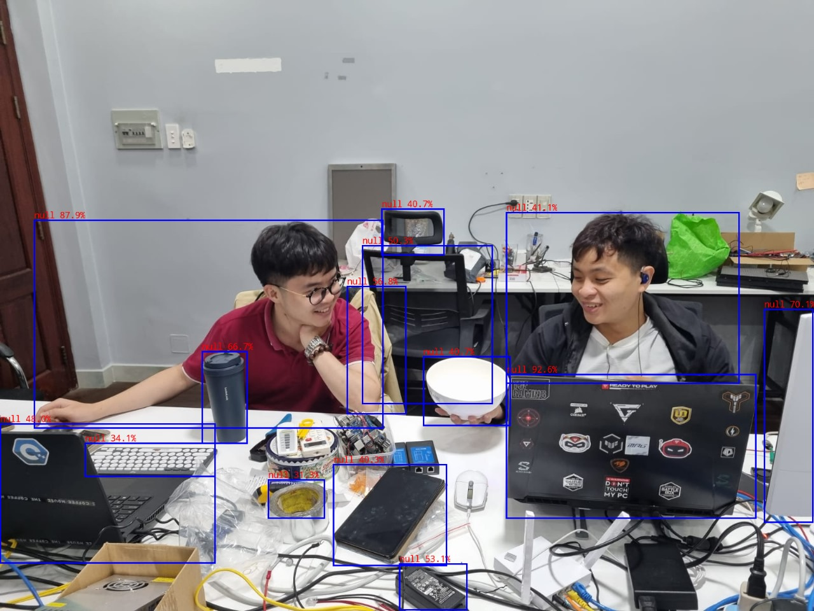

# GOADS-TRACK_VIEW

## Description

Dự án này dường như là một phần mềm hoặc module phát hiện đối tượng (object detection) được gọi là "GOADS-TRACK_VIEW". Nó được thiết kế để chạy trên nền tảng RK3566, cụ thể là trên OrangePi3B. Mục tiêu của dự án là nhận diện các đối tượng trong hình ảnh và hiển thị kết quả dưới dạng nhãn (label), điểm số (score) và tọa độ của hộp giới hạn (bounding box) tương ứng.

Cụ thể, dự án này có các đặc điểm sau:

Nền tảng Hỗ trợ: **RK3566 - OrangePi3B**.

Chức năng: Phát hiện và theo dõi các đối tượng trong hình ảnh.
Kết quả mong đợi: Hiển thị nhãn (label) của các đối tượng được phát hiện, điểm số (score) đánh giá mức độ chắc chắn của việc phát hiện, và tọa độ của hộp giới hạn (bounding box) xung quanh đối tượng.

Hiển thị Kết quả: Kết quả được hiển thị dưới dạng văn bản, với mỗi dòng biểu diễn một đối tượng được phát hiện bao gồm nhãn, tọa độ của bounding box và điểm số.

Hình ảnh Kết quả: Một hình ảnh được cung cấp để minh họa các đối tượng được phát hiện, với các bounding box được vẽ xung quanh chúng.

Dự án này có thể được sử dụng trong nhiều ứng dụng khác nhau như giám sát an ninh, nhận diện khuôn mặt, hoặc phát hiện đối tượng trong các ứng dụng thực tế khác. Nó cung cấp một cơ sở để xây dựng các hệ thống tự động nhận diện và theo dõi đối tượng.

## Cách build và run


## Kết quả mong đợi

Ví dụ này sẽ in nhãn và điểm tương ứng của kết quả phát hiện ảnh thử nghiệm như sau:

```
person @ (211 241 283 507) 0.873
person @ (109 235 225 536) 0.866
```



# Đóng góp bới

1. Báo thủ số 1: [Nguyễn Trung Nhật](nhatnt@goads.vn)
2. Báo thủ số 2:  [Phạm Ngọc Sang](sangpn@goads.vn)
3. Báo thủ số 3: [Phạm Thanh Phong](phongpt@goads.vn)
